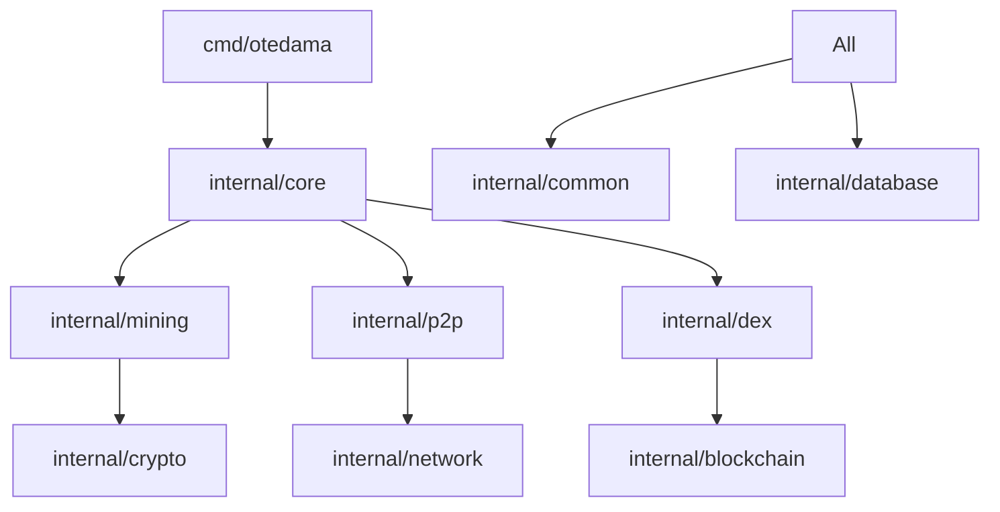

# Otedama Project Structure

## 📁 Directory Overview

```
Otedama/
├── 📄 README.md                    # Main entry point with language selection
├── 📄 LICENSE                      # MIT License
├── 📄 PROJECT_STRUCTURE.md         # This file
├── 📄 .gitignore                   # Git ignore rules
├── 📄 go.mod                       # Go module definition
├── 📄 go.sum                       # Go module checksums
│
├── 📁 cmd/                         # Application entry points
│   ├── otedama/                    # Main application
│   ├── migrate/                    # Database migration tool
│   └── test-runner/                # Test execution tool
│
├── 📁 internal/                    # Private application code
│   ├── analytics/                  # Analytics and metrics
│   ├── api/                        # REST/WebSocket API handlers
│   ├── asic/                       # ASIC miner integration
│   ├── auth/                       # Authentication & authorization
│   ├── backup/                     # Backup and recovery
│   ├── benchmark/                  # Performance benchmarks
│   ├── blockchain/                 # Blockchain integration
│   ├── common/                     # Shared utilities
│   ├── config/                     # Configuration management
│   ├── core/                       # Core business logic
│   ├── cpu/                        # CPU mining implementation
│   ├── crypto/                     # Cryptographic functions
│   ├── currency/                   # Multi-currency support
│   ├── database/                   # Database layer
│   ├── defi/                       # DeFi features
│   ├── dex/                        # DEX implementation
│   ├── gpu/                        # GPU mining (CUDA/OpenCL)
│   ├── hardware/                   # Hardware optimization
│   ├── logging/                    # Structured logging
│   ├── memory/                     # Memory management
│   ├── middleware/                 # HTTP/API middleware
│   ├── mining/                     # Mining engine core
│   ├── monitoring/                 # System monitoring
│   ├── network/                    # Network management
│   ├── optimization/               # Performance optimization
│   ├── p2p/                        # P2P networking
│   ├── pool/                       # Mining pool logic
│   ├── profit/                     # Profit switching
│   ├── protocol/                   # Mining protocols
│   ├── proxy/                      # Proxy services
│   ├── security/                   # Security features
│   ├── stratum/                    # Stratum protocol
│   ├── testing/                    # Testing utilities
│   └── worker/                     # Worker management
│
├── 📁 pkg/                         # Public packages
│   └── (future public packages)
│
├── 📁 config/                      # Configuration files
│   ├── config.yaml                 # Main configuration
│   ├── config.example.yaml         # Example configuration
│   └── config.production.yaml      # Production settings
│
├── 📁 scripts/                     # Utility scripts
│   ├── install.sh                  # Installation script
│   ├── deploy.sh                   # Deployment script
│   ├── backup.sh                   # Backup script
│   ├── performance_test.sh         # Performance testing
│   ├── postgres-init.sql           # Database initialization
│   └── otedama.service             # Systemd service file
│
├── 📁 docs/                        # Documentation
│   ├── README.md                   # Documentation index
│   ├── 📁 en/                      # English documentation
│   │   ├── INDEX.md                # English doc index
│   │   ├── README.md               # Main documentation
│   │   ├── ARCHITECTURE.md         # System architecture
│   │   ├── DEPLOYMENT_GUIDE.md     # Deployment instructions
│   │   ├── ROADMAP.md              # Development roadmap
│   │   └── ...                     # Other English docs
│   ├── 📁 ja/                      # Japanese documentation
│   │   ├── INDEX.md                # Japanese doc index
│   │   ├── README_JP.md            # Japanese README
│   │   └── ...                     # Other Japanese docs
│   ├── 📁 zh/                      # Chinese documentation
│   ├── 📁 ko/                      # Korean documentation
│   └── 📁 [other languages]/       # 30+ language support
│
├── 📁 legal/                       # Legal documents
│   ├── README.md                   # Legal doc index
│   ├── TERMS_OF_SERVICE.md         # Terms of service
│   ├── PRIVACY_POLICY.md           # Privacy policy
│   ├── DISCLAIMER.md               # Legal disclaimer
│   └── RISK_DISCLOSURE.md          # Risk disclosure
│
├── 📁 web/                         # Web UI assets
│   ├── 📁 admin/                   # Admin interface
│   │   ├── index.html              # Admin dashboard
│   │   └── login.html              # Admin login
│   └── 📁 static/                  # Static assets
│       ├── css/                    # Stylesheets
│       ├── js/                     # JavaScript
│       └── img/                    # Images
│
├── 📁 test/                        # Integration tests
│   ├── e2e/                        # End-to-end tests
│   ├── integration/                # Integration tests
│   └── fixtures/                   # Test fixtures
│
├── 📁 ansible/                     # Ansible deployment
│   ├── playbooks/                  # Deployment playbooks
│   └── templates/                  # Configuration templates
│
├── 📁 docker/                      # Docker files
│   ├── Dockerfile                  # Development image
│   ├── Dockerfile.production       # Production image
│   └── docker-compose.yml          # Docker compose config
│
├── 📁 k8s/                         # Kubernetes manifests
│   ├── namespace.yaml              # Namespace definition
│   ├── deployment.yaml             # Deployment config
│   ├── service.yaml                # Service definition
│   └── configmap.yaml              # Configuration map
│
├── 📁 monitoring/                  # Monitoring configs
│   ├── prometheus.yml              # Prometheus config
│   ├── grafana/                    # Grafana dashboards
│   └── alerts.yml                  # Alert rules
│
├── 📁 test_results/                # Test output directory
│   └── performance_*.txt           # Performance test results
│
└── 📁 .github/                     # GitHub specific
    ├── workflows/                  # GitHub Actions
    ├── ISSUE_TEMPLATE/             # Issue templates
    └── PULL_REQUEST_TEMPLATE.md    # PR template
```

## 🏗️ Architecture Layers

### 1. **Presentation Layer** (`web/`, `docs/`)
- Web UI for admin and monitoring
- Multi-language documentation
- API documentation

### 2. **API Layer** (`internal/api/`)
- REST endpoints
- WebSocket handlers
- Mobile API
- Admin API

### 3. **Business Logic** (`internal/`)
- Mining engine
- P2P networking
- DEX/DeFi logic
- Pool management

### 4. **Data Layer** (`internal/database/`)
- PostgreSQL repositories
- Redis caching
- Migration scripts

### 5. **Infrastructure** (`scripts/`, `ansible/`, `k8s/`)
- Deployment automation
- Container orchestration
- Monitoring setup

## 📦 Key Components

### Mining System
- **Engine**: `internal/mining/` - Core mining logic
- **Algorithms**: `internal/optimization/` - Algorithm implementations
- **Hardware**: `internal/gpu/`, `internal/cpu/`, `internal/asic/`
- **Pool**: `internal/pool/` - Pool management

### P2P Network
- **Core**: `internal/p2p/` - P2P networking
- **Protocol**: `internal/protocol/` - Communication protocols
- **Stratum**: `internal/stratum/` - Stratum implementation

### DeFi/DEX
- **DEX**: `internal/dex/` - Decentralized exchange
- **DeFi**: `internal/defi/` - Staking, lending, governance
- **Blockchain**: `internal/blockchain/` - Smart contracts

### Security
- **Auth**: `internal/auth/` - Authentication/authorization
- **Security**: `internal/security/` - Security features
- **Backup**: `internal/backup/` - Backup and recovery

## 🔧 Development Workflow

1. **Core Code**: All business logic in `internal/`
2. **Public APIs**: Reusable packages in `pkg/` (future)
3. **Entry Points**: Application starts from `cmd/`
4. **Configuration**: YAML files in `config/`
5. **Documentation**: Language-specific in `docs/[lang]/`
6. **Testing**: Unit tests alongside code, integration in `test/`

## 📝 File Naming Conventions

- **Go Files**: `snake_case.go`
- **Test Files**: `*_test.go`
- **Documentation**: `UPPER_CASE.md` for main docs
- **Config Files**: `lowercase.yaml`
- **Scripts**: `lowercase.sh`

## 🚀 Getting Started

1. Review main [README.md](./README.md)
2. Check language-specific docs in `docs/[your-language]/`
3. Configure using `config/config.example.yaml`
4. Build from `cmd/otedama/`
5. Deploy using scripts in `scripts/` or `k8s/`

## 📊 Module Dependencies



## 🔒 Security Considerations

- Private code in `internal/` - not importable by external packages
- Sensitive configs in environment variables
- Legal compliance documents in `legal/`
- Security features in `internal/security/`

---

*This structure follows Go best practices and supports enterprise-grade deployment while maintaining clarity and maintainability.*