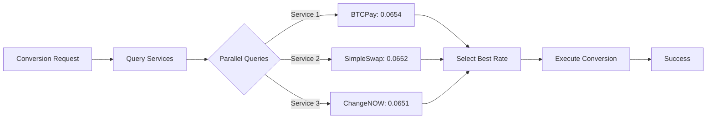
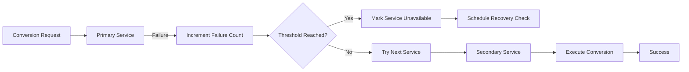
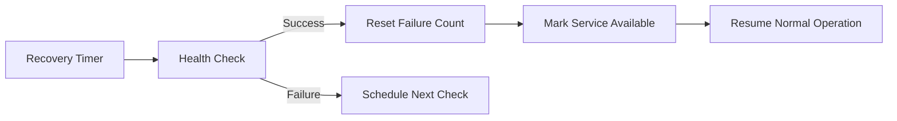

# Multi-Service Failover System

## Overview

The Otedama mining pool implements a sophisticated multi-service failover system that ensures cryptocurrency conversions always succeed by utilizing multiple conversion services simultaneously. When one service fails or becomes unavailable, the system automatically switches to alternative services without interrupting operations.

## Architecture

### Service Hierarchy

```
Primary Services (Priority 1)
├── BTCPay Lightning (40% weight) - 0% fees
├── SimpleSwap (30% weight) - 0% fees + spread
└── ChangeNOW (30% weight) - 0.5% fees

Secondary Services (Priority 2)
├── CoinPayments (50% weight) - 0.5% fees
└── CoinGate (50% weight) - 1% fees

Backup Services (Priority 3)
├── Binance (60% weight) - 0.1% + withdrawal
└── Kraken (40% weight) - 0.16% + withdrawal

Emergency Services (Priority 4)
└── DEX integrations - Variable fees
```

## Key Features

### 1. Parallel Rate Queries
- Queries multiple services simultaneously
- Selects best rate in real-time
- Timeout protection (5 seconds max)
- Automatic rate comparison

### 2. Health Monitoring
- Continuous service health checks
- Response time tracking
- Success rate monitoring
- Automatic service recovery detection

### 3. Circuit Breaker Pattern
- Prevents cascading failures
- Automatic service isolation
- Configurable failure thresholds
- Timed recovery attempts

### 4. Load Balancing Strategies

#### Weighted Distribution
```javascript
// Default strategy - distributes based on service weights
services: [
  { id: 'btcpay_lightning', weight: 0.4 },  // 40% of traffic
  { id: 'simpleswap', weight: 0.3 },       // 30% of traffic
  { id: 'changenow', weight: 0.3 }         // 30% of traffic
]
```

#### Round-Robin
```javascript
// Equal distribution across all services
loadBalancing: 'round-robin'
```

#### Least-Used
```javascript
// Routes to service with fewest recent requests
loadBalancing: 'least-used'
```

## Configuration

### Basic Setup

```javascript
// config/default.json
{
  "multiService": {
    "enabled": true,
    "parallelQueries": true,
    "maxParallelRequests": 3,
    "requestTimeout": 5000,
    "loadBalancing": "weighted",
    "autoFailover": true,
    "alwaysUseBestRate": true
  }
}
```

### Service Configuration

```javascript
const multiService = new MultiServiceConverter({
  services: [
    {
      id: 'btcpay_lightning',
      priority: ServicePriority.PRIMARY,
      weight: 0.4,
      maxFailures: 3,
      recoveryTime: 300000  // 5 minutes
    },
    {
      id: 'simpleswap',
      priority: ServicePriority.PRIMARY,
      weight: 0.3,
      maxFailures: 5,
      recoveryTime: 600000  // 10 minutes
    }
  ],
  
  // Failover settings
  maxServiceFailures: 3,
  serviceRecoveryTime: 300000,
  
  // Rate optimization
  alwaysUseBestRate: true,
  maxRateDifference: 0.02  // 2% max acceptable difference
});
```

## Operation Flow

### 1. Normal Operation



### 2. Service Failure



### 3. Automatic Recovery



## Monitoring

### Service Status Dashboard

```bash
# Get real-time service status
curl http://localhost:8080/api/v1/multi-service/status

# Response
{
  "services": {
    "btcpay_lightning": {
      "available": true,
      "priority": 1,
      "weight": 0.4,
      "totalRequests": 15234,
      "successRate": 0.995,
      "averageResponseTime": 245,
      "failures": 0,
      "lastFailure": null
    },
    "simpleswap": {
      "available": true,
      "priority": 1,
      "weight": 0.3,
      "totalRequests": 11456,
      "successRate": 0.987,
      "averageResponseTime": 367,
      "failures": 1,
      "lastFailure": 1702314567000
    },
    "changenow": {
      "available": false,
      "priority": 1,
      "weight": 0.3,
      "totalRequests": 10987,
      "successRate": 0.923,
      "averageResponseTime": 512,
      "failures": 5,
      "lastFailure": 1702315123000
    }
  },
  "healthyServices": 2,
  "totalConversions": 37677,
  "failovers": 156,
  "loadBalancing": "weighted"
}
```

### Performance Metrics

```javascript
// Get service performance metrics
const metrics = multiService.getStats();

console.log({
  totalConversions: metrics.totalConversions,
  serviceUsage: metrics.serviceUsage,
  failoverCount: metrics.failovers,
  averageResponseTime: metrics.averageResponseTime,
  healthyServices: metrics.healthyServices
});
```

## Failure Scenarios

### 1. Single Service Outage
- Automatic detection within 30 seconds
- Immediate failover to next priority service
- No impact on conversion operations
- Service marked for recovery monitoring

### 2. Multiple Service Failures
- Cascading to secondary services
- Degraded mode with backup services
- Alert generation for operators
- Emergency DEX activation if needed

### 3. Rate Anomalies
- Automatic exclusion of anomalous rates
- Fallback to historical averages
- Manual intervention alerts
- Service quarantine if persistent

### 4. Network Partitions
- Regional failover support
- Cross-datacenter redundancy
- Eventual consistency handling
- Split-brain prevention

## Best Practices

### 1. Service Configuration
- Always configure at least 3 primary services
- Set appropriate weights based on reliability
- Adjust failure thresholds per service
- Configure reasonable recovery times

### 2. Monitoring
- Set up alerts for service failures
- Monitor success rates regularly
- Track response time trends
- Review failover patterns

### 3. Testing
- Regular failover drills
- Chaos engineering practices
- Load testing all services
- Recovery time validation

### 4. Optimization
- Adjust weights based on performance
- Fine-tune timeout values
- Optimize parallel query count
- Balance rate vs reliability

## API Integration

### Using Multi-Service Converter

```javascript
// Initialize with custom configuration
const converter = new MultiServiceConverter({
  services: [
    { id: 'btcpay_lightning', priority: 1, weight: 0.5 },
    { id: 'simpleswap', priority: 1, weight: 0.3 },
    { id: 'changenow', priority: 1, weight: 0.2 }
  ],
  parallelQueries: true,
  alwaysUseBestRate: true
});

// Convert with automatic failover
const result = await converter.convert({
  fromCoin: 'ETH',
  toCoin: 'BTC',
  amount: 1.5,
  address: 'bc1qxy2kgdygjrsqtzq2n0yrf2493p83kkfjhx0wlh'
});

// Result includes service used
console.log(`Conversion completed via ${result.service}`);
```

### Handling Failures

```javascript
converter.on('service:failure', ({ serviceId, failures }) => {
  console.log(`Service ${serviceId} failed (${failures} times)`);
});

converter.on('failover:success', ({ from, to }) => {
  console.log(`Failover from ${from} to ${to} successful`);
});

converter.on('service:recovered', ({ serviceId }) => {
  console.log(`Service ${serviceId} has recovered`);
});
```

## Troubleshooting

### Service Not Failing Over
1. Check failure threshold configuration
2. Verify circuit breaker state
3. Ensure alternative services are configured
4. Check network connectivity

### Poor Rate Selection
1. Verify rate comparison is enabled
2. Check parallel query timeout
3. Review service weights
4. Validate rate calculation logic

### Slow Response Times
1. Reduce parallel query count
2. Optimize timeout values
3. Check service health
4. Review network latency

### Recovery Not Working
1. Check recovery time configuration
2. Verify health check endpoints
3. Review service logs
4. Test manual recovery

## Security Considerations

### API Key Management
- Separate keys per service
- Regular key rotation
- Encrypted storage
- Access logging

### Rate Limiting
- Per-service rate limits
- Global rate limiting
- Burst protection
- DDoS mitigation

### Data Validation
- Rate sanity checks
- Address validation
- Amount verification
- Service response validation